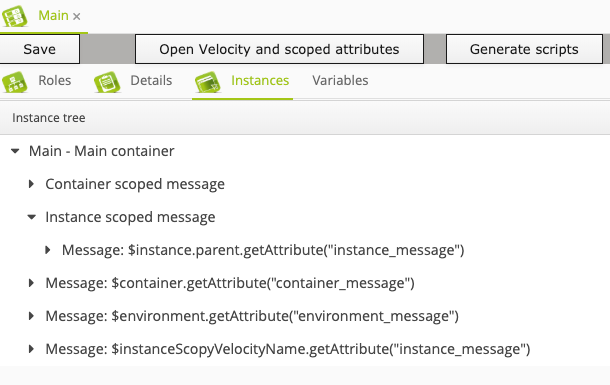

# Infraxys A to Z: 02 - Using Apache Velocity and scoped attributes

Velocity can be used in both files and packets. 
We've already seen how this works for packet files in the previous example.
See [Apache Velocity](https://infraxys.io/topics/apache-velocity/) for a detailed explanation on what's available in Infraxys.
 
In this example we will:
- Create a new "Scoped attributes"-packet with attributes that have instance, container and environment scope.
- Use multiple columns for instance forms. 
- Copy the packet of the "Hello world"-example and make the "display_message"-attribute parsable with Velocity.
- Add a packet file that uses Velocity.
- Create an environment with containers. 
- Create instances that use Velocity to retrieve values from other attributes:
    - from the same instance
    - from child instances
    - from parent instances
    - from container-level attributes  
    - from environment-level attributes  
   
## Prerequisites

Executed the [01 - Hello World](../01-hello-world/README.md)-example.

## Steps

- Open the Modules-tab in the right Utils-slider and create the following packets under your module:

### Packet - Instance scoped attribute

| Attribute | Value | Remark |
| :-------- | :---- | :----- |
| Name | Instance scoped attribute | |
| Instance label | %instance_message% | |

#### instance_message attribute

- Add an attribute through the context-menu:

| Attribute | Value | Remark |
| :-------- | :---- | :----- |
| Attribute | instance_message | |
| Caption | Instance message | |
| Type | Text (one line) | |

### Packet - Container scoped attribute

| Attribute | Value | Remark |
| :-------- | :---- | :----- |
| Name | Container scoped attribute | |
| Instance label | %container_message% | |

#### container_message attribute

This message-attribute will be at the container-scope.

- Add an attribute through the context-menu:

| Attribute | Value | Remark |
| :-------- | :---- | :----- |
| Attribute | container_message | |
| Caption | Container message | |
| Type | Text (one line) | |
| Scope | Container | |

### Packet - Environment scoped attribute

| Attribute | Value | Remark |
| :-------- | :---- | :----- |
| Name | Environment scoped attribute | |
| Instance label | %environment_message% | |

#### environment_message attribute

This message-attribute will be at the environment-scope.

- Add an attribute through the context-menu:

| Attribute | Value | Remark |
| :-------- | :---- | :----- |
| Attribute | environment_message | |
| Caption | Environment message | |
| Type | Text (one line) | |
| Form column | 2 | Place this attribute in the second column |
| Scope | Environment | |

### Packet - Velocity example

- Open the Modules-tab in the right Utils-slider.
- Copy the packet "Display message" from the previous example and paste it using the context-menu of the "Packets"-item under your exercise-module.
- Rename it from "Display message1" to "Velocity example" and click "Save".

#### display_message attribute

This attribute will retrieve its value from other instances using Apache Velocity. 
We'll create multiple instances to demonstrate several ways to retrieve data from other instances.

Open the display_message attribute, select 'Parse with Velocity' and save your changes.

## Create other resources

- Add an environment using the context-menu of the "Environments"-element under your example module. 
- Specify "Velocity and scoped attributes" for the name and click "Save".
- In the containers-tab, add two new containers called "Main" and "Environment scope example" using the "Add container" context-menu.
- Open container "Environment scope example".
- Drag "Environment scoped attribute"-packet from the module-tree and drop it on the root instance.
- Specify "environment notification" for "Environment message".
- Drag "Instance scoped attribute" onto the root instance. We'll use this to demonstrate the use of Velocity names to directly reference an instance from anywhere in the environment.
- Specify "Instance scope notification with velocity name" for "Instance message".
- Specify "instanceScopeVelocityName" for "Velocity name".
- Click Save and close the container.
- Open the "Main"-container.
- Drop "Instance scoped attribute" on the root-instance.

| Attribute | Value | Remark |
| :-------- | :---- | :----- |
| Instance message | Instance scoped message |  |

- Drop "Velocity example"-packet on this new "Scoped attributes" instance so that it becomes a child of it.

| Attribute | Value | Remark |
| :-------- | :---- | :----- |
| Display message | $instance.parent.getAttribute("instance_message") | $instance is a Java object representing an instance. $instance.parent returns the direct parent-instance of this one |

- Drop "Container scoped attribute" on the root-instance.

| Attribute | Value | Remark |
| :-------- | :---- | :----- |
| Container message | Container scoped message |  |

- Drop another "Velocity example"-packet on the root-instance.

| Attribute | Value | Remark |
| :-------- | :---- | :----- |
| Display message | $container.getAttribute("container_message") | $container is a Java object representing a container.

- Drop another "Velocity example"-packet on the root-instance.

| Attribute | Value | Remark |
| :-------- | :---- | :----- |
| Display message | $environment.getAttribute("environment_message") | This will get the attribute value of the instance on the other container. |

- Drop another "Velocity example"-packet on the root-instance.

| Attribute | Value | Remark |
| :-------- | :---- | :----- |
| Display message | $instanceScopeVelocityName.getAttribute("instance_message") | $instanceScopeVelocityName returns the instance with this Velocity name that we created on the "Environment scope example"-container. |

- Close all tabs
- Drop environment "Velocity and scoped attributes" from your module onto the "Example modules"-project.
- Right-click the environment under the project and select "Generate scripts".

> If you get an error like the following:
> ```
> Script generation failed
> Container:		Main
> Instance:		Message: $instanceScopeVelocityName.getAttribute("instance_message")
> Attribute:		display_message
> Message:		Variable $instanceScopeVelocityName has not been set at attribute value[line 1, column 1]
> ```
> The this means that no instance exists in the environment with Velocity name 'instanceScopeVelocityName'. Find the instance and enter the correct Velocity to fix this. 

If everything went well, 6 actions are created. 

- Open the "Main"-container.
- We don't see that there's an instance underneath the "Instance scoped message". Let's first fix this.
- Select "Open packet" from the context-menu of the "Instance scoped message"-instance.
- Select "Auto expand", click "Save" and close this packet.
- Close and re-open the "Main"-container. The child of the "Instance scoped message"-instance will now be visible.
 
Your Main-container instance tree should now look like the following:



You can now execute the executions for the "Velocity example"-example instances and see that the values of the referenced attributes are displayed.

## Next

[Multiple inheritance with packets and optional action generation](https://github.com/infraxys-modules/infraxys-by-example/blob/master/modules/infraxys-a-to-z/03-multiple-inheritance-with-packets-and-conditional-actions/README.md)