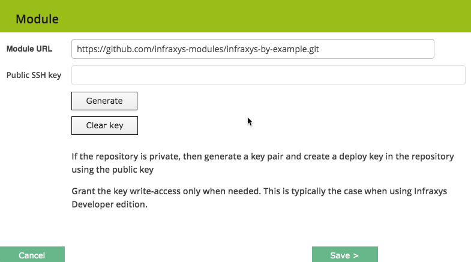
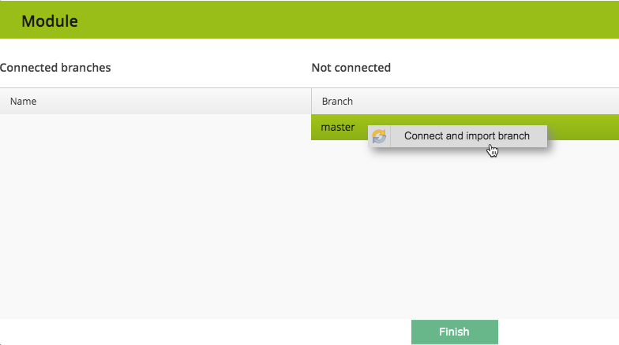
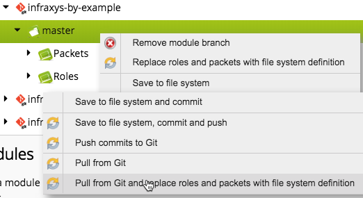

# Prerequisites

You have an Infraxys Developer Edition running.
The examples assume that you will follow them step-by-step. If this is the case, then a GitHub-repository should be created as well.

## Setup your environment

The examples assume that the following configuration is already in place.

## Infraxys container setup
- Create project "infraxys-by-example" underneath a project of your choice.
- Create environment "examples" under this project.
- Create a container "examples" under this environment.

## GitHub module repository setup

See <a href="https://infraxys.io/topics/modules/" target="_blank">Infraxys modules</a> on how to setup your module repository.

## Setup this infraxys-by-example module (optional)

If you're not creating the packets and such in your own GitHub-repository, then you'll need this repository to be able to run the examples:

- Open the Modules-tab in the right slider.
- Right-click in the Module-tree and select "Add module".
- Specify `https://github.com/infraxys-modules/infraxys-by-example.git` for Module URL.

- No need to specify an SSH key here since we're not going to modify this module.
- Click the "Save >"-button. Infraxys will retrieve the branches from the module.

- Right-click the master-branch and select the import option. Infraxys will import all available packets and modules.
- Click "Finish".

When new examples are added, you can import them through the context-menu of this master-branch:
