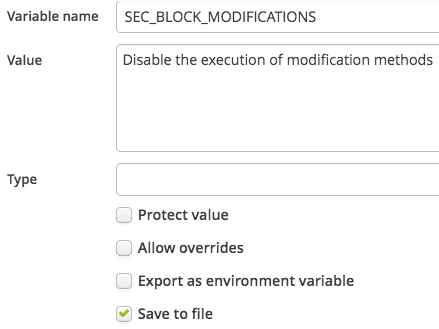
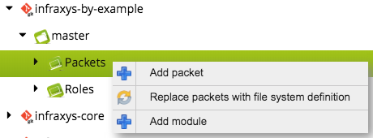
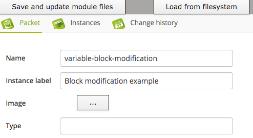
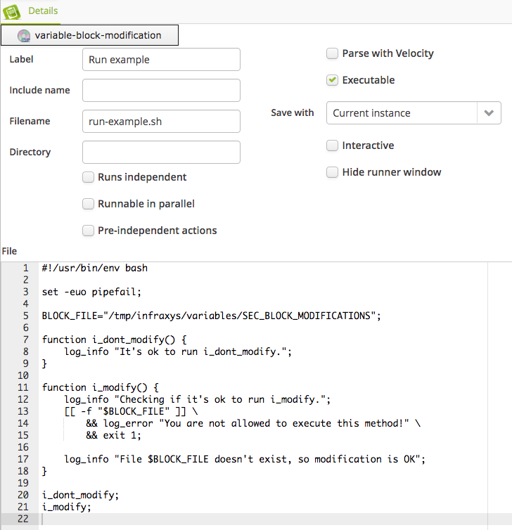
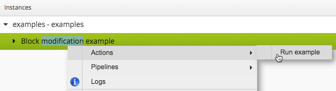
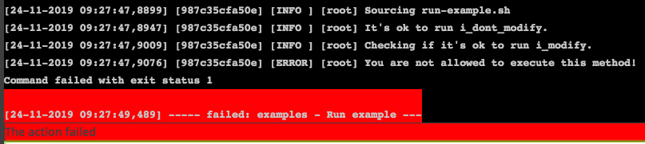
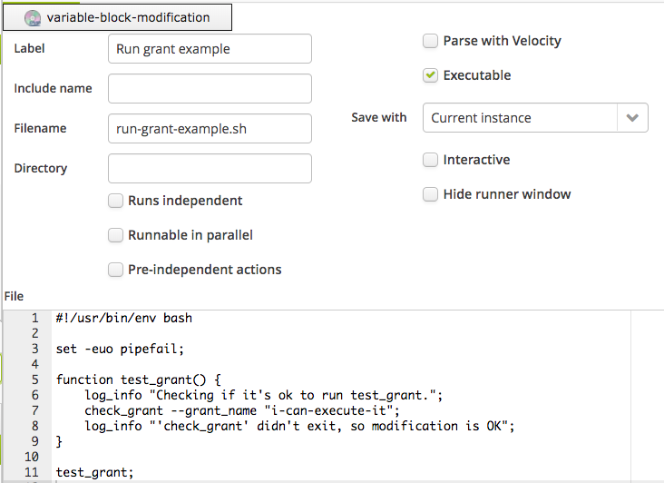
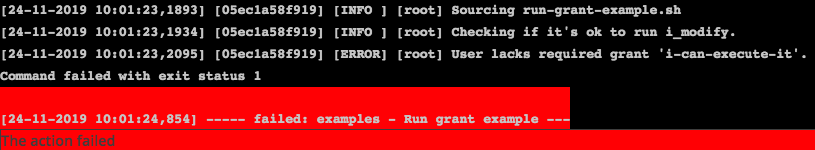
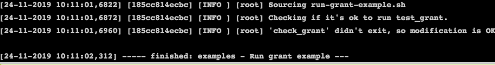

# Securing methods using variables

See <a href="https://infraxys.io/concepts/resource-types/variable/" target="_blank">Infraxys Variables</a> for more information.

Variables can be created at the project, environment and container level. This means that blocking a function can be managed at a higher project then the root-project of a user.

This example shows 2 ways on how to protect the execution of a method in Bash. The same procedure can be used for any other language.


Using grants is not available for Infraxys Developer.


## Prerequisites

See the prerequisites-section [here](../../README.md)


## 1. Create the variable

Open the "infraxys-by-example"-project in Infraxys and click the "Variables"-tab.  
Right-click in the space below the tab and select "Create item".

Set the following values:
- uncheck "Protect value". This allows users to change and view the variable later.
- uncheck "Export as environment variable". Environment variables can be overwritten, so using the variable this ways is insecure.
- uncheck "Allow overrides". The variable cannot be overridden in any sub-project, environment or container.
- check "Save to file". A readonly file with the name of the variable will be available in a variables-directory.



## 2. Create the packet (optional)

> Follow this part if you're using your own module repository.   

- Open the modules-tab in the right-slider and add a packet to your practice-module:


- Specify the following details and save the packet.



### Block a method for everyone
- Click the "Files"-tab and add a file through the context-menu for the space below the tab. Make sure "Executable" is selected.


```bash
#!/usr/bin/env bash

set -euo pipefail;

BLOCK_FILE="/tmp/infraxys/variables/SEC_BLOCK_MODIFICATIONS";

function i_dont_modify() {
	log_info "It's ok to run i_dont_modify.";
}

function i_modify() {
	log_info "Checking if it's ok to run i_modify.";
	[[ -f "$BLOCK_FILE" ]] \
		&& log_error "You are not allowed to execute this method!" \
		&& exit 1;
	
	log_info "File $BLOCK_FILE doesn't exist, so modification is OK";
}

i_dont_modify;
i_modify;
```

The path shouldn't contain variables because they could be overwritten.
- Create an environment under the project with the variable.
- Create a container under the project.
- Click the "Instances"-tab after saving the container.
- Drag the new packet from the Modules-tree onto the root instance of the container.
- Click save.
- Click "Generate scripts".
- Right-click on the new packet and execute the action:
  
The result will look like the following:


 
### Only allow method invocation for users with specific grants

This method is not available in Infraxys Developer since no users and profiles can be managed.

Here we'll create an action that will fail if the user doesn't have custom grant "i-can-execute-it".  

We'll use Bash function "check_grant" for this. It's provided by the infraxys-core module. 
check_grant is a convenience method that exits the action if the current user doesn't have the specified grant. It executes readonly script /tmp/infraxys/system/has_grant which can be invoked from other languages as well.

#### Create the custom grant "i-can-execute-it"

- Open a project that contains an account to test this setup.
- Open the "Profiles"-tab.
- Click "Create profile" in the context-menu.
- Save and close the profile.
- Open the "Custom grants"-tab.
- Click "Create grant" in the context-menu.
- Call it "i-can-execute-it" and click "Save".
- Drag above profile to the right column "Profiles with this grant". Users that have this profile now have this grant.

#### Create another action

- Open the packet "variable-block-modification" and add a second executable file.


```bash
#!/usr/bin/env bash

set -euo pipefail;

function test_grant() {
	log_info "Checking if it's ok to run test_grant.";
	check_grant --grant_name "i-can-execute-it";
	log_info "'check_grant' didn't exit, so modification is OK";
}

test_grant;
```

- Open the instances-tab on the container with this "variable-block-modification"-packet.
- Generate scripts so that they are available on the provisioning server for this environment.
- Execute action "Run grant example" on the "Block modification example"-instance.
- If you don't have grant "i-can-execute-it" assigned through a profile, then the action will exit:

- Otherwise, you'll get:


